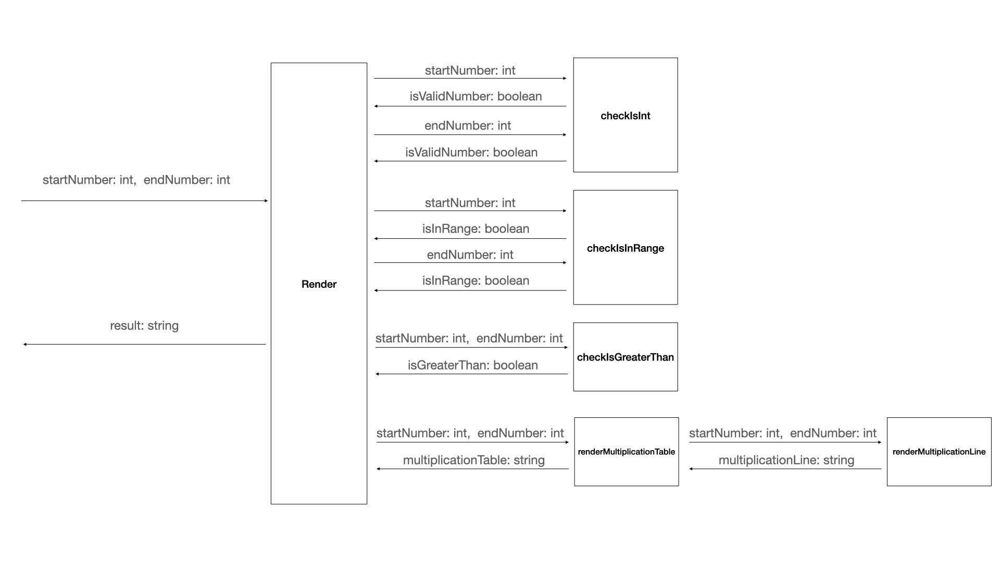

# Business Requirement
As a student, I'd like to get a multiplication table of a specified range. 
The input should be 2 integers specifying the start and the end of the table:

AC1: The start number should not be greater than the end number, otherwise the function will return nothing.

AC2: The start number and the end number can be any integer in a range of 1 to 10 (inclusive).

AC3: The output should be a string represents the multiplication table. Suppose that the start number is *2* and the end number is *4*, the output should be something like the following.

```
2*2=4
2*3=6  3*3=9
2*4=8  3*4=12  4*4=16
```

# Practice Requirement
1. Please draw the whole tasking diagram.

2. Please declare all the functions according to your diagram.
3. Please write a test case following given...when...then pattern for a leaf block of the diagram. Then implement the block to pass the test. Should only test the `render` method.

AC1: The start number should not be greater than the end number, otherwise the function will return nothing.
```
given: start number > end number 
when: render
then: throw ErrorInputException
```

AC2: The start number and the end number can be any integer in a range of 1 to 10 (inclusive).
```
given: start number not in range of 1 to 10 for example 12，-1
when: render
then: throw ErrorInputException
```
```
given: end number not in range of 1 to 10 for example 12，-1
when: render
then: throw ErrorInputException
```
AC3: The output should be a string represents the multiplication table. Suppose that the start number is *2* and the end number is *4*, the output should be something like the following.

```
given: start number 1,end number 5
when: render
then: numbers should be {1:[1],2:[1,2],3:[1,2,3],4:[1,2,3,4],5:[1,2,3,4,5]}
```
```
given: start number 1,end number 5
when: render
then: return table 
1*1=1
1*2=2 2*2=4
1*3=3 2*3=6 3*3=9
1*4=4 2*4=8 3*4=12 4*4=16
1*5=5 2*5=10 3*5=15 4*5=20
```
4. Please repeat step 3 until all functions are implemented.
