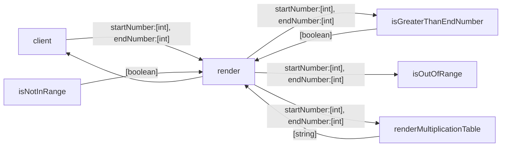

# Business Requirement
As a student, I'd like to get a multiplication table of a specified range. 
The input should be 2 integers specifying the start and the end of the table:

AC1: The start number should not be greater than the end number, otherwise the function will return nothing.

AC2: The start number and the end number can be any integer in a range of 1 to 10 (inclusive).

AC3: The output should be a string represents the multiplication table. Suppose that the start number is *2* and the end number is *4*, the output should be something like the following.

```
2*2=4
2*3=6  3*3=9
2*4=8  3*4=12  4*4=16
```

AC1: The start number should not be greater than the end number, otherwise the function will return nothing.

    TASK 1 : should return false when call isGreaterThanEndNumber given start number 3 and end number is 2

AC2: The start number and the end number can be any integer in a range of 1 to 10 (inclusive).

    TASK 2: should return true when call isGreaterThanEndNumber given start number 0 and end number is 2
    TASK 3: should return false when call isOutOfRange given start number 0 smaller than 1
    TASK 4: should return false when call isOutOfRange given end number 11
    TASK 5: should return false when call isOutOfRange given end number 10

AC3: The output should be a string represents the multiplication table. Suppose that the start number is *2* and the end number is *4*, the output should be something like the following.
    
    TASK 6: should return true when call isOutOfRange given end number 9 and start number 1
    TASK 7: should return multiplication table when call render given start number 2 and end number 4
# Practice Requirement
1. Please draw the whole tasking diagram.

2. Please declare all the functions according to your diagram.
3. Please write a test case following given...when...then pattern for a leaf block of the diagram. Then implement the block to pass the test. Should only test the `render` method.
4. Please repeat step 3 until all functions are implemented.
