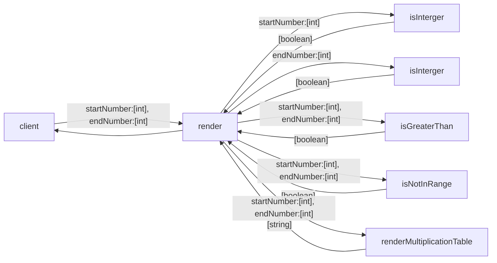

# Business Requirement
As a student, I'd like to get a multiplication table of a specified range. 
The input should be 2 integers specifying the start and the end of the table:

AC1: The start number should not be greater than the end number, otherwise the function will return nothing.

AC2: The start number and the end number can be any integer in a range of 1 to 10 (inclusive).

AC3: The output should be a string represents the multiplication table. Suppose that the start number is *2* and the end number is *4*, the output should be something like the following.

```
2*2=4
2*3=6  3*3=9
2*4=8  3*4=12  4*4=16
```
AC1: The start number should not be greater than the end number, otherwise the function will return nothing.
    TASK 1 : given start number 3 when greater than end number that is 2 then return null
AC2: The start number and the end number can be any integer in a range of 1 to 10 (inclusive).
    TASK 2 : given start number 0 when greater than end number that is 2 then return null
    TASK 3: given end/start number 0 when smaller than 1 then return null
    TASK 4: given end/start number 11 when greater than 10 then return null
AC3: The output should be a string represents the multiplication table. Suppose that the start number is *2* and the end number is *4*, the output should be something like the following.
    TASK 5: given start number 

# Practice Requirement
1. Please draw the whole tasking diagram.

2. Please declare all the functions according to your diagram.
3. Please write a test case following given...when...then pattern for a leaf block of the diagram. Then implement the block to pass the test. Should only test the `render` method.
4. Please repeat step 3 until all functions are implemented.
