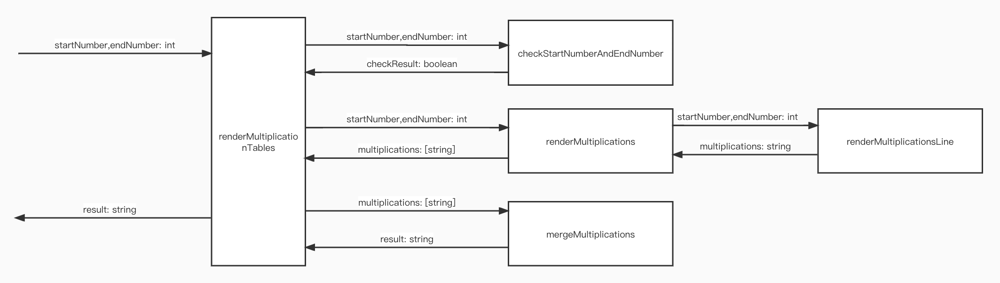

# Tasking

1. Check the start number S and the end number E, S and E should in range (1,10) and S is not larger than E
2. Render multiplications given the start number S and the end number E
2.1 Render multiplications line given the start number S and the end number E
3. Merge multiplications strings

# Context Map
