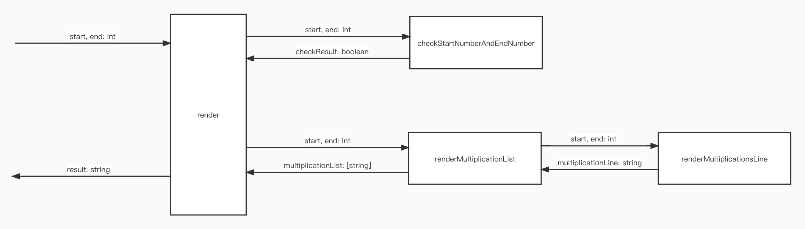

# Tasking

1. Check the start number and the end number: the start number and the end number should be in range (1,10) and the start number is not larger than the end number
- Input: start, end: int
- Output: checkResult: boolean

2. Render the multiplication list from the start number to the end number
- Input: start, end: int
- Output: multiplicationList: string[]

3. Render the multiplication line given the start number and the multiply number
- Input: start, multiply: int
- Output: multiplicationLine: string

# Context Map
